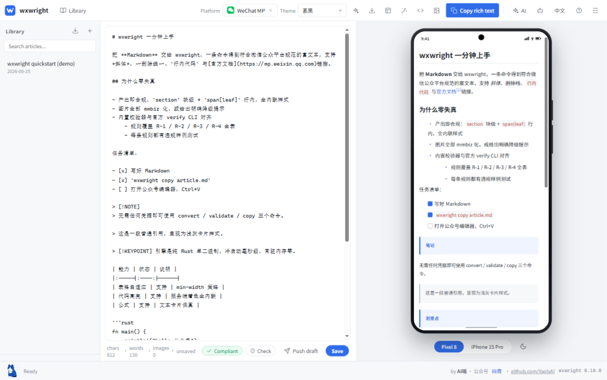
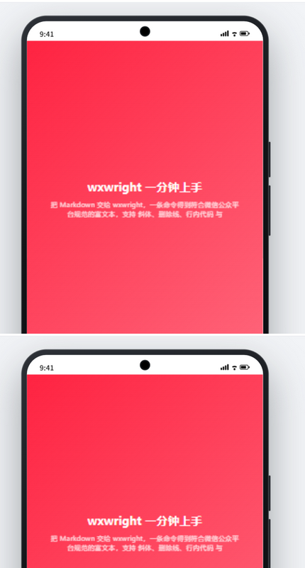
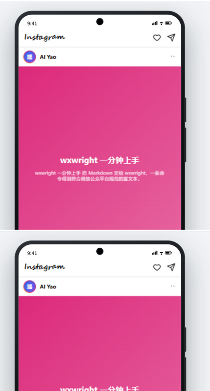
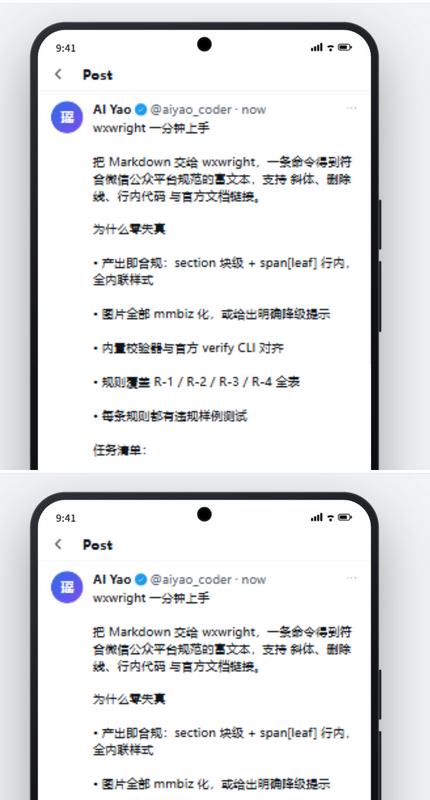
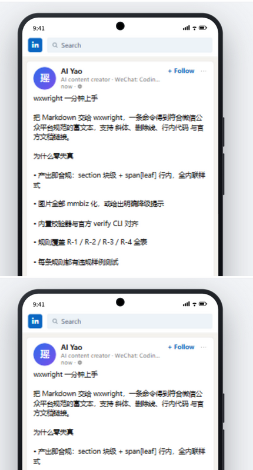
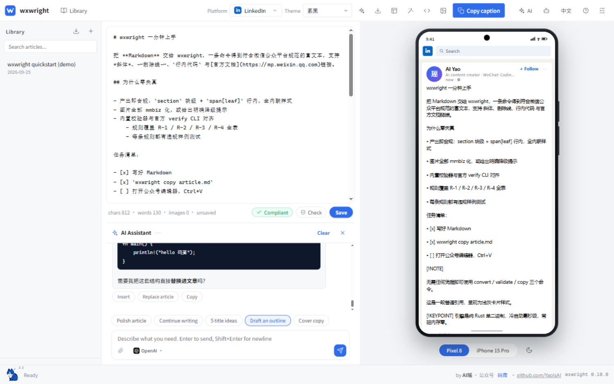
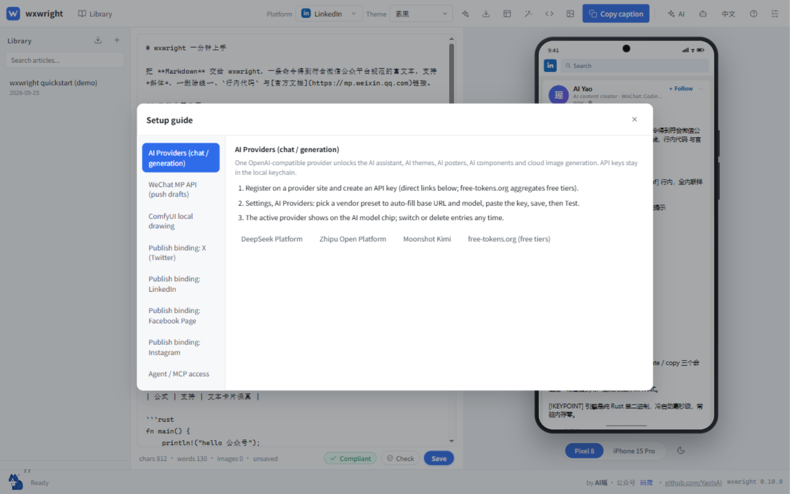

<div align="center">



# wxwright

**一份 Markdown，全平台分发。** AI 辅助写作、像素级平台预览、符合公众号规范的富文本——粘贴零样式失真。

[](https://github.com/YaoIsAI/wxwright/releases)
[](https://github.com/YaoIsAI/wxwright/actions/workflows/ci.yml)
[](#许可证)
[](#下载)
[](https://www.rust-lang.org)

[下载](#下载) · [30 秒上手](#30-秒上手) · [面向 AI Agent](#面向-ai-agent) · [截图](#截图) · English: [README.md](README.md)

</div>

wxwright 是一个「桌面客户端 + Rust 引擎」的社媒写作工具：你写（或让 AI Agent 替你写）一篇 Markdown，同一份信源会按平台分别渲染、校验与导出——微信公众号方言排版现已完整支持，小红书 / 知乎 / Facebook / Instagram / X / LinkedIn 预览与导出适配内建。

## 截图

每个平台都有自己的像素级预览壳，按真实产品字号与配色 1:1 还原：

| 小红书笔记 | Instagram 帖子 |
|:---:|:---:|
|  |  |

| X 帖子 | LinkedIn 卡片 |
|:---:|:---:|
|  |  |

AI 助手陪你写作——流式输出、随时停止，每条回复可一键**插入 / 替换文章 / 复制**：



## 下载

到 [Releases 页面](https://github.com/YaoIsAI/wxwright/releases) 获取安装包（v0.10.0）：

| 平台 | 文件 |
|---|---|
| Windows | `wxwright_0.10.0_x64-setup.exe`（安装向导）或 `wxwright-cli-windows-x64.zip`（便携 CLI） |
| macOS | `wxwright_0.10.0_x64.dmg`（Apple silicon；未签名——首次打开请右键 → 打开） |
| Linux | `wxwright_0.10.0_amd64.deb` 或 `.AppImage` |
| CLI（全平台） | `wxwright-cli-*.zip / .tar.gz` |

## 30 秒上手

```bash
# 1. 转换（无需任何凭据）
wxwright convert article.md --theme minimal --out article.html

# 2. 剪贴板全链路：转换 -> 图片 -> 规范化 -> 校验 -> 写入剪贴板
wxwright copy article.md
# 然后打开公众号编辑器，Ctrl+V 粘贴
```

## 面向 AI Agent

把 `wxwright agent-card --md` 输出的整段卡片贴进任意 Agent 的系统提示，Agent 即刻接手。机读合同：`wxwright agent-card --json`。

MCP 一行接入：

```bash
wxwright mcp install --target claude   # 或 cursor | vscode | opencode
wxwright mcp serve                     # stdio MCP server
```

工具：`wxwright_convert`、`wxwright_validate`、`wxwright_copy`、`wxwright_themes_list`、`wxwright_upload_images`、`wxwright_draft_create`、`wxwright_draft_list`、`wxwright_export`。资源：`wxwright://themes`、`wxwright://spec/rules`（完整规则表，中英双语）。提示：`wxwright-publish-guide`。

退出码：`0` 通过 · `1` 违规 · `2` 运行异常。所有命令支持 `--json`（稳定 schema，非 TTY 默认 JSON）与 stdin（`-`）。

## 为什么不同

公众号编辑器是加固版 ProseMirror：外部样式表被丢弃、class/id 失效、大量"魔法样式"（opacity 藏图、固定像素宽、height:0 折叠）在编辑器里正常、发布后或移动端直接坏掉。多数转换器只对齐编辑器视图；wxwright 对齐全部四视图：编辑器、PC 已发布、移动端、Dark Mode。

1. **引擎而非脚本** —— 一个纯 Rust core（`wxwright-core`），CLI / MCP / GUI 共享；未来移动端 FFI 复用同一颗大脑。
2. **先生成正确的，再校验** —— 主题直接渲染成官方方言（`section` 块级 + `span[leaf]` 行内、全内联样式）；normalizer 与 validator 是第二道防线。
3. **全量规则引擎** —— 官方规范每条规则（R-1.1 … R-4.4）都有生成策略 + 自动修复 + 检测，每条至少一个违规样例测试；内置校验器与官方 `verify-article-structure-spec`（puppeteer CLI）对齐，后者作为 CI 真值门禁。
4. **本地极致性能** —— 单静态二进制、零守护、零 IPC。Release SLO：万字全链路 p50 ≤ 60ms、CLI 单平台 ≤ 8MB（见 `docs/performance.md`）。

## 零失真的四个条件

`wxwright copy` 只有在四条同时满足时才会成功（PRD §3.5）：

1. 载荷正确：自包含 `text/html`，全内联样式，无 `<style>`/`class`/`script`/外部字体；
2. 结构正确：HTML 本身就长在官方白名单内；
3. 图片正确：mmbiz 域（或明确警告的 https 直链）；本地/base64 图片会被**阻断并列出清单**——粘贴必挂；
4. 真值验证：内置校验器 + CI 中的官方 CLI 桥。

配置凭据（`wxwright login`）后，本地图片自动上传永久素材并改写为 mmbiz；`wxwright draft create` 直接写入草稿箱 (Drafts)。

## 主题

内置三套：`minimal` 素黑 / `techblue` 科技蓝 / `magazine` 杂志。主题即数据：TOML 色板 + 可选的角色样式覆盖，渲染期展开为内联样式。`wxwright theme new my-theme` 生成脚手架；`wxwright theme validate` 保证其产出合规后才可进仓库。全引擎禁用 `font-family`（官方规则 R-3.1）——主题无法夹带。

GUI 里还有 **AI 主题生成**：一句话描述风格（例如「赛博朋克深空，纯黑底霓虹紫」），得到一套已通过官方规范校验的全新主题，CLI 与 GUI 共用。渲染器同样支持 GitHub alert 语法（`> [!NOTE]` / `[!TIP]` / `[!IMPORTANT]` / `[!WARNING]` / `[!CAUTION]` 提示卡）、`> [!COMMENT]` 留言卡、`> [!KEYPOINT] 文字` 划重点卡、`[TOC]` 目录卡、图注与 `chart` 图表块。

## 桌面客户端


`wxwright-gui`（Tauri 2）：

- **三栏布局**：文章库（左）/ 编辑器（中）/ 手机框预览（右），Dark Mode 模拟、一键复制富文本、导出 HTML、拖拽载入 .md。
- **文章库**：本地 Markdown 存储（`文档/wxwright/articles`，frontmatter 元数据）；切换自动保存、点击重新打开、删除、新建。
- **AI 助手**：编辑器下方 Codex 式对话抽屉 - 流式输出，支持任意 OpenAI 兼容 Provider（OpenAI / DeepSeek / 通义 / Kimi / 智谱，或本地 Ollama / LM Studio）。API Key 存系统钥匙串。快捷指令：润色 / 续写 / 起标题 / 提纲；每条回复可一键插入 / 替换 / 复制。
- **Agent 接入面板**（机器人图标）：一键写入 Claude Desktop / Cursor / VS Code / OpenCode 的 MCP 配置、一键复制 Agent 卡片、CLI 速查表。同一引擎，同一合规约束。
- **AI 主题生成**：描述风格，得到通过官方规范校验的全新主题，CLI 与 GUI 共用。
- **海报工坊**：HTML -> PNG 本地光栅化（SVG foreignObject，完全离线），内置公众号标准封面尺寸；支持 AI 生成海报；一键导出插入文章。
- **真实手机样机**：iPhone 15 Pro（灵动岛、实体侧键、Home 条）与 Pixel 8（打孔摄像头）按真实硬件绘制，样机下方双按钮切换，深浅色切换在旁；预览保持真实逻辑分辨率并自适应缩放。
- **素材库**：海报导出、AI 绘图、粘贴截图、拖入图片统一进入网格化管理（`文档\wxwright\assets`）：缩略图浏览、一键插入文章、删除。
- **ComfyUI 本地 AI 绘图**：自动检测本机 ComfyUI（默认 `127.0.0.1:8188`，设置中可改）。检测到即可调用本地 Stable Diffusion 文生图 / 图生图（队列 + 轮询 + 取图），产物直接进素材库与文章。零云端、零密钥。
- **规范徽标**常驻字符统计行（彩色阻断/提示计数），明细面板不再遮挡 AI 助手。
- **一键推草稿**（微信）：状态栏「推草稿」按钮按文章主题渲染、本地图片自动上传 mmbiz、阻断违规门禁后直接写入公众号草稿箱。
- **写作宠物墨仔**：一只真正的坐姿猫（胡须、眨眼、卷尾）。打字时弹跳、45 秒入睡、点击冒爱心、连点 logo 三次触发彩蛋；点击状态栏「码聋」弹出公众号二维码。

GUI 二进制同时响应 `wxwright-gui.exe mcp serve`，单独安装 GUI 也能充当 MCP server。

## 发布绑定（BYO，无云服务）

海外平台使用**你自己的**开发者应用——本工具不提供云服务，凭据只存本机：

- **X (Twitter)** 与 **LinkedIn**：一键登录已端到端实装（OAuth 2.0 PKCE / code flow + 本地回环回调，令牌存系统钥匙串）。导出文案已是推文/帖子格式。
- **Facebook / Instagram**：凭据接口就绪；登录流受 Meta 应用审核与 Instagram 公网图床要求所限（详见 `docs/social-publish-oauth-feasibility.md`）。

各平台的逐步注册与登录教程在顶栏 **?（配置引导）**里——含官方门户直达与各平台费用说明（X API 自 2026-02 起按量计费）。



## 安全

- AppSecret 存系统钥匙串（Windows 凭据管理器 / macOS Keychain / libsecret），配置文件只存引用；`WXWRIGHT_MP_APPID` / `WXWRIGHT_MP_SECRET` 环境变量供 CI 覆盖。
- 发布绑定的 OAuth 令牌同样只存系统钥匙串；状态接口绝不返回令牌或密钥。
- 日志中 access_token 恒为掩码。
- `publish`（群发）必须显式 `--yes`；默认写路径是草稿箱。
- 零遥测、零云端依赖。

## 已知限制

- 公式以样式化文本卡片保真（图片模式需要 KaTeX 桥，规划中）。
- `R-2.1` 深层同样式嵌套链：可检测，不自动展开。
- `--official-check` 输出指引与 CI 命令；puppeteer 实际执行在 CI。
- 剪贴板富文本（text/html）在 Windows/macOS/Linux 三端均尝试写入（arboard 3.6），仅在剪贴板无法接受 HTML 时（如无头 CI）降级纯文本。
- clap 内置 help 为英文；报告文案已双语（en / zh-CN）。
- macOS 构建未签名（Gatekeeper：右键 → 打开，或 `xattr -cr wxwright.app`）。

## 自动发布

打 tag（`git tag v0.10.1 && git push origin v0.10.1`）即可由 GitHub Actions 自动构建全平台产物（Windows NSIS 安装包、macOS dmg、Linux deb + AppImage、四目标 CLI 包 + SHA256SUMS）并挂到 Release。CI 同时运行三平台测试矩阵与官方 puppeteer 规范门禁。详见 `docs/release-automation.md`。

## 作者

**AI瑶** - 微信公众号：**码聋**（微信号：`CodeDeafness`） · [github.com/YaoIsAI](https://github.com/YaoIsAI)

GUI 状态栏里住着写作宠物「墨仔」，记得去摸摸它；点击状态栏「码聋」可弹出公众号二维码。

<div align="center">

**关注公众号**


微信扫码关注「码聋」 · 微信号：`CodeDeafness`

</div>

## 许可证

MIT OR Apache-2.0
