<!-- docs/tutorial.md - the full illustrated manual. Screenshots live in
     docs/screenshots/manual/. Regenerate: the manual article in the app
     library (20260929-101500-manual-v2) is the editable source of truth. -->

# wxwright 使用手册（图文完整版）

> 本文同时是 wxwright 的宣传页与逐按钮使用手册：18 张实拍截图覆盖每一个页面与按钮。
> 英文快速上手见 [README](../README.md)；Agent 接入见 [agent-integration](agent-integration.md)。

# 你只管写，剩下的交给引擎

> [!KEYPOINT] 一句话说清 wxwright
> 你写 Markdown，它负责排版、合规、配图、多平台适配——一篇稿子，公众号点一下「复制」，其余平台各有出口。完全免费，完全开源。

写公众号的人都懂那种疲惫：文章半小时，排版两小时。样式在编辑器里好好的，发出去就变形；想配图，来回切换好几个工具；想发个视频号图文、小红书笔记，又得重新排版一遍。

wxwright 把这一切收进一个桌面应用：左边写作，中间预览，右边是一台真机——你的文章在 iPhone 15 Pro 里实时亮相。排版的活儿，引擎替你干了。

本文既是**宣传页**，也是**逐按钮的使用手册**：18 张实拍截图，覆盖应用里每一个页面、每一个按钮。文章有点长，建议先收藏。

```chart
{"kind":"bar","title":"wxwright 0.11 一览","labels":["适配平台","内置主题","MCP 工具","自动化测试"],"values":[7,7,8,182],"unit":"个"}
```

## 三分钟上手

1. 打开 wxwright，左侧文章库点「新建文章」，或直接把 .md 文件拖进窗口。
2. 中间编辑器写 Markdown，右侧真机预览实时刷新。
3. 底部点「校验」确认合规，点「复制富文本」，到公众号编辑器 Ctrl+V——排版零失真。

> [!TIP]
> 文章头部 frontmatter 记录 title、theme、platform：换主题、切平台，预览和导出自动跟着走。

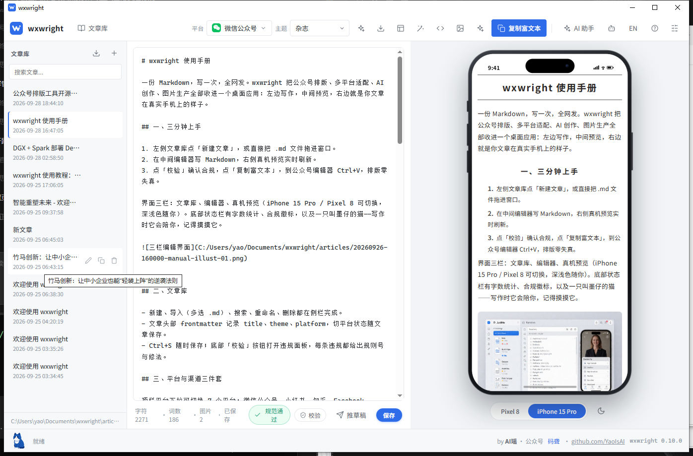

*主界面全景：左文章库 / 中编辑器 / 右真机预览，底部状态栏带合规徽标*

## 主界面：每个按钮在哪里

顶栏从左到右：

| 按钮 | 作用 |
|---|---|
| 文章库 | 收起 / 展开左侧文章库面板 |
| 平台 | 切换目标平台（微信 / 小红书 / 知乎 / X 等 7 个），预览、规则、导出联动 |
| 主题 | 选择排版主题，预览即时换装 |
| 火花（AI 生成主题） | 一句话描述风格，AI 生成整套合规主题 |
| 下载（导出 HTML） | 把当前排版导出为独立 HTML 文件 |
| 海报工坊 | HTML 排版生成封面图，内置公众号全部封面尺寸 |
| AI 绘图 | 接本地 ComfyUI 或云端模型生图 |
| SVG 互动组件库 | 插入点击描边、闪烁按钮等公众号可用的互动组件 |
| 素材库 | 所有图片资产统一管理，一键插入文章 |
| AI 配图 | 0.11 新增：自动规划插图位、生成、裁剪、插入一条龙 |
| 复制富文本 | 主按钮：排版结果进剪贴板，去公众号编辑器 Ctrl+V |
| AI 助手 | 展开底部对话抽屉（润色 / 续写 / 起标题 / 提纲） |
| Agent 接入 | 一键把 wxwright 接入 Claude / Cursor 等编程 Agent |
| EN | 中英双语切换 |
| ？ 配置引导 | 逐步注册与登录教程 |
| 齿轮 设置 | AI Provider、公众号 API、发布绑定、ComfyUI |

底部状态栏：字符 / 词数 / 图片 / 已存统计、「规范通过」徽标（点击展开违规明细）、「校验」按钮、「推草稿」按钮、「保存」按钮。左下角那只猫叫墨仔——打字时它会跟着弹跳，记得摸摸它。

## 文章库：左侧栏

- 新建、导入（可多选 .md）、搜索、重命名、删除，全部在侧栏完成。
- 每篇文章自动保存；切走再切回，内容不丢。
- 文章 frontmatter 里的 platform 是文章属性：这篇发公众号，那篇发小红书，互不干扰。

## 平台与渠道三件套

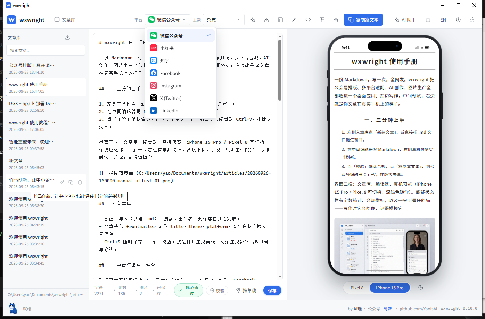

*平台切换菜单：7 个平台，切换后预览、合规规则、导出物三者联动*

每个平台是一套「预览形态 + 合规规则表 + 导出物」：微信公众号出方言富文本，小红书出笔记文案，知乎出 Markdown。切换平台，右侧真机立刻变成那个平台的模样。

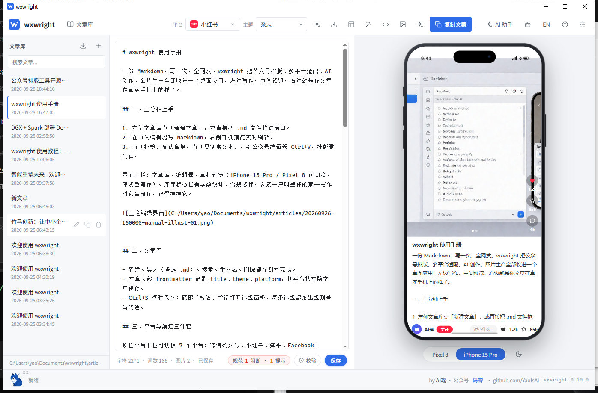

*同一篇文章切到小红书：笔记壳、封面、文案一次到位*

## AI 助手：会自己用工具的对话

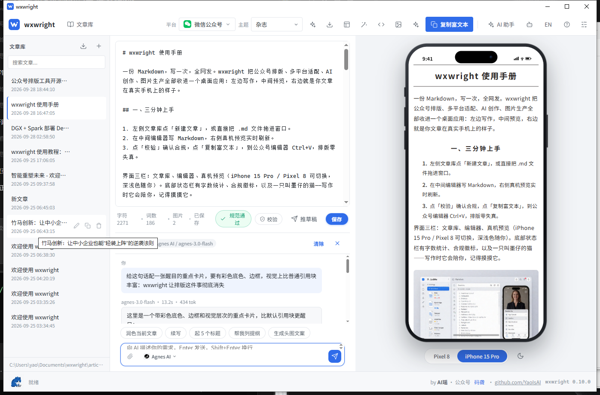

*AI 助手：流式对话 + 快捷指令，回复可一键插入文章*

- 接任意 OpenAI 兼容服务商（DeepSeek、通义、Kimi、智谱、本地 Ollama 都行），密钥只进系统钥匙串。
- 快捷指令面板：润色、续写、起标题、列提纲。
- 0.11 新增工具调用：助手能自己调用「校验 / 转换 / 导出 / 主题清单 / 草稿清单」五个只读工具，回复前先自检。
- 需要比 Markdown 更丰富的版式时，助手会走白名单 HTML 通道——卡片、徽章、分栏直接渲染进文章。

## AI 主题工坊

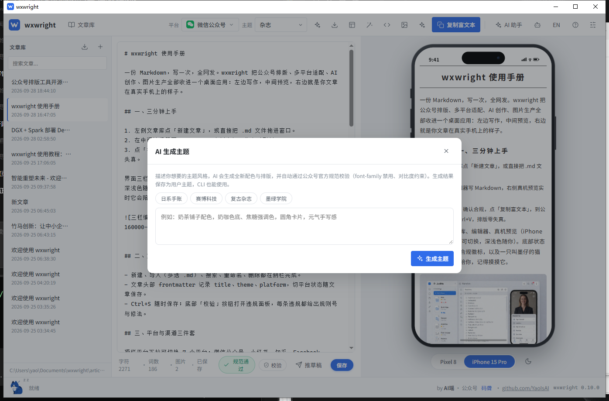

*AI 主题：描述风格，几十秒拿到一套通过官方规范校验的新主题*

内置日系手账、赛博科技、复古杂志、墨绿学院等风格chip，也可以自由描述。生成前先过一遍官方规范校验，不过关自动重试——AI 给的主题拿来就能用。0.11 起主题支持「内容变体」：金句引用、首段导语可以有独立样式，引擎按内容自动判定。

## AI 配图：一键从文字到成稿

> [!IMPORTANT]
> 这是 0.11 的新能力：工具栏点火花形「AI 配图」按钮，AI 会通读你的文章、规划插图位（锚点必须真实存在才生效）、逐张生成图片、按平台尺寸裁剪、插到对应段落——文章回来就是配好图的成稿。

支持云端图像模型（设置里配好即可）与本地 ComfyUI 双源。生成过程随时可点「停止」。

## 海报工坊

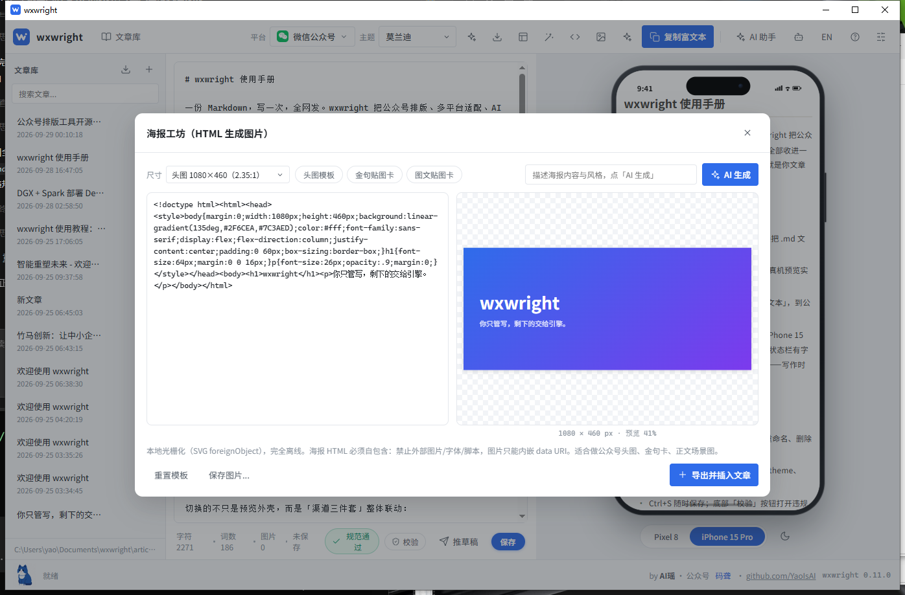

*海报工坊：HTML 排版转 PNG，完全本地离线*

按钮：AI 生成海报（描述需求出排版）、重置模板、保存 PNG、导出图组、插入文章。头图 1080×460、次图 1080×1080 等公众号标准尺寸全部内置。

## 尺寸工坊

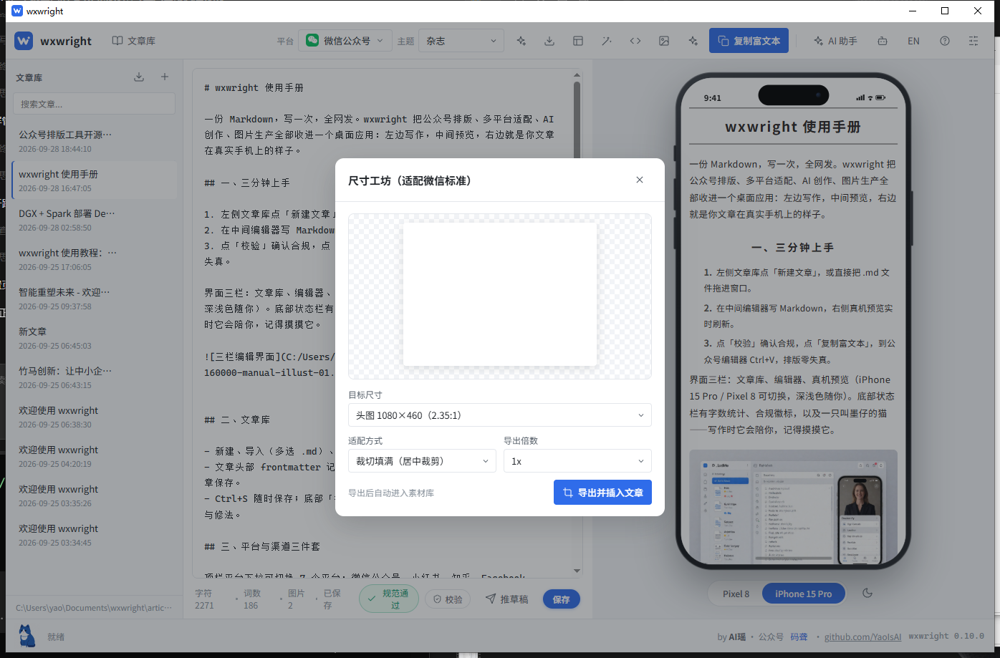

*尺寸工坊：任意 HTML 转指定尺寸图片*

输入或粘贴 HTML，选尺寸预设，一键导出图片——做封面、做配图都行。

## SVG 互动组件库

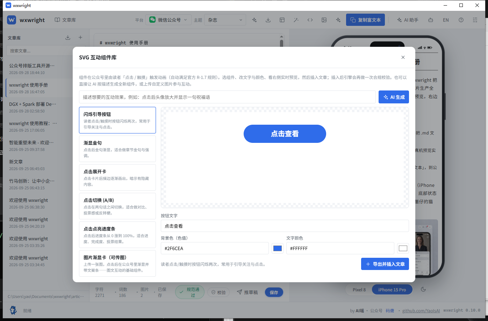

*SVG 组件库：公众号编辑器可用的互动组件*

内置闪烁引导按钮、描边绘制卡、渐显标语等组件，支持 AI 生成自定义组件、上传 SVG、取色器。所有组件遵循官方 R-1.7 规则（PC 端也能正常回退显示）。

## 素材库

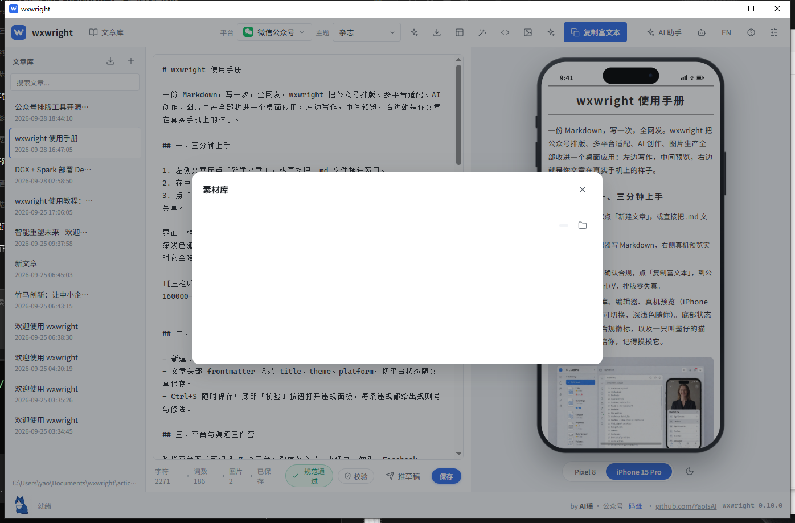

*素材库：海报、AI 绘图、截图、拖入图片统一网格管理*

按钮：打开文件夹、缩略图浏览、一键插入文章、删除。

## ComfyUI 本地 AI 绘图

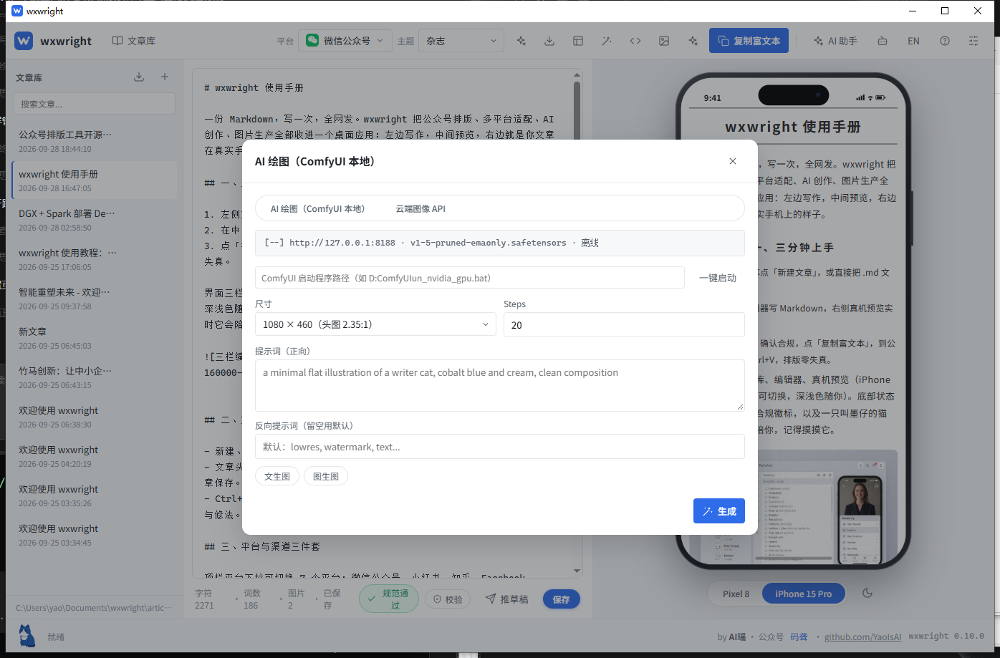

*AI 绘图：本地 ComfyUI 与云端模型双通道*

本地 ComfyUI 零云端零密钥；没有 ComfyUI 也可以在设置里配云端图像模型。文生图 / 图生图双模式，产物直接进素材库。

## Agent 接入：让编程 Agent 替你发文

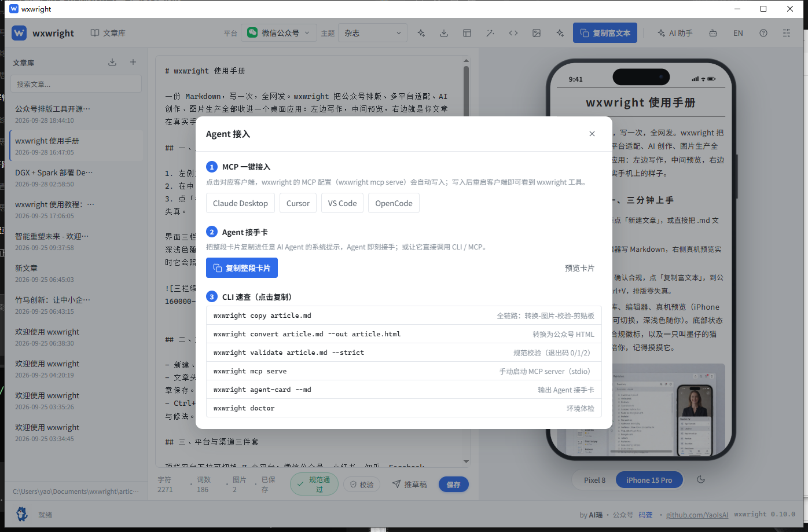

*Agent 面板：一键安装 MCP，复制 Agent 卡片*

一键写入 Claude Desktop / Cursor / VS Code / OpenCode 的 MCP 配置，或复制 Agent 卡片给任何 AI Agent。8 个 MCP 工具覆盖转换、校验、复制、上传、推草稿、导出——你的 Agent 从此会排版。

## 设置：三页看完全部配置

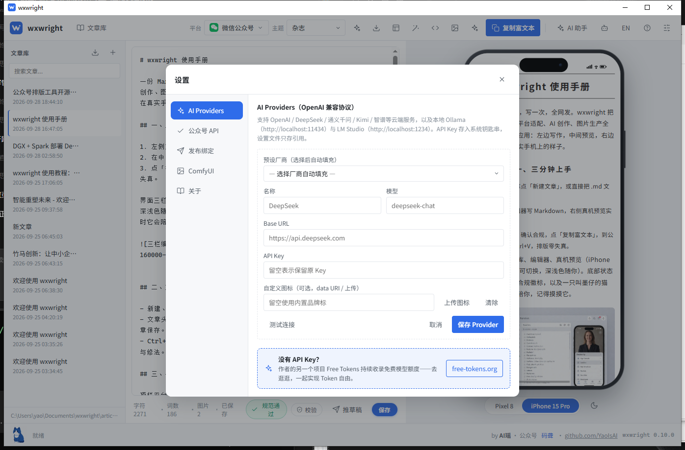

*设置第一页：AI 服务商管理（新增 / 测试 / 启用 / 删除，密钥仅存钥匙串）*

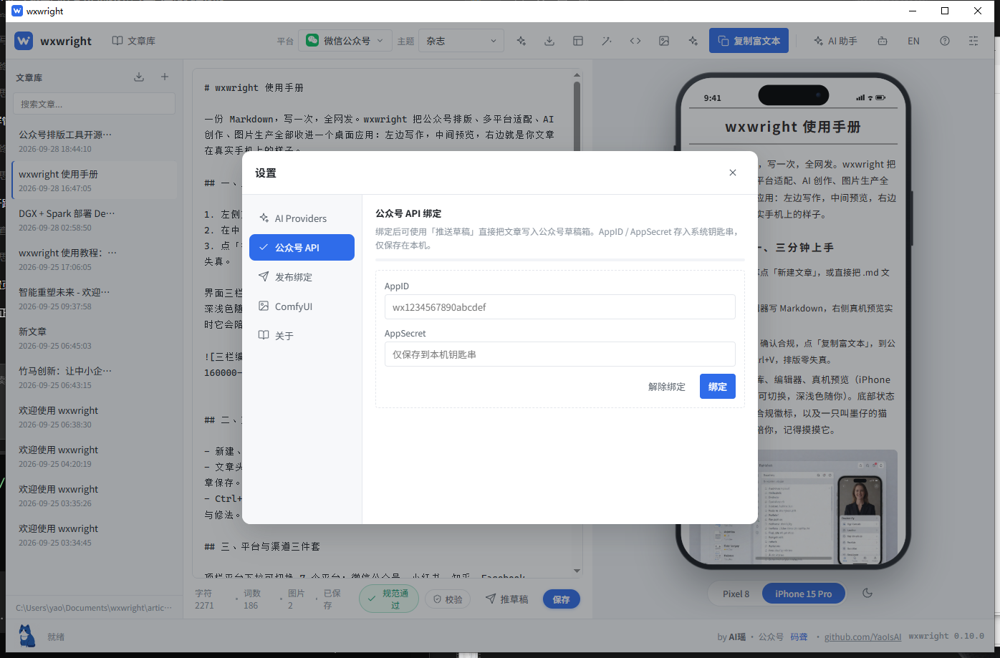

*设置第二页：公众号 API 绑定（AppID / AppSecret 只进系统钥匙串）*

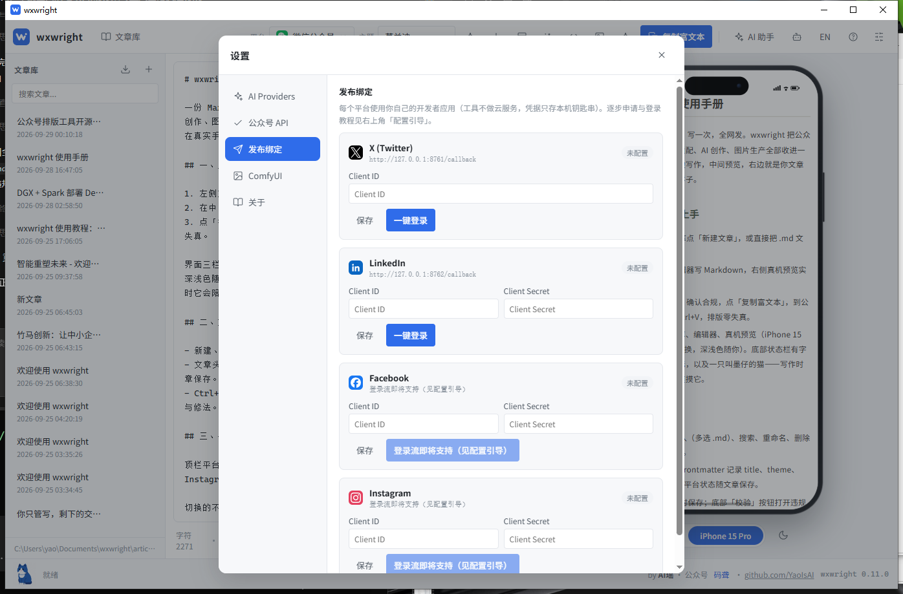

*设置第三页：X / LinkedIn 一键登录，Facebook / Instagram 凭据接口*

## 帮助中心：配置不再迷路

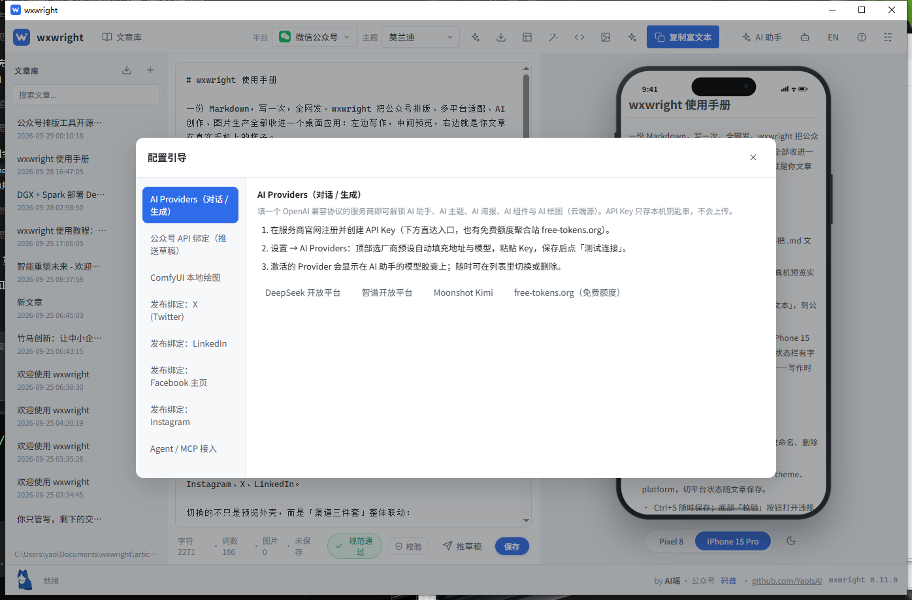

*配置引导：各平台逐步注册与登录教程*

顶栏「？」按钮，从公众号 IP 白名单到 X API 计费，每一步都有直达门户与说明。

## 合规徽标：违规无处藏身

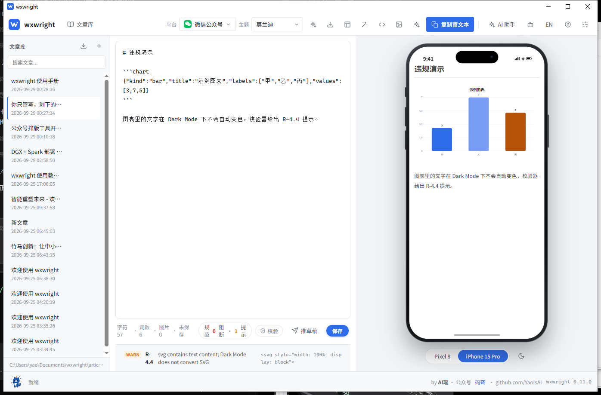

*违规面板：每条违规给出规则编号与修法*

统计行的「规范通过」徽标实时反映文章健康度，点开看明细：哪条规则、为什么、怎么改。0.11 起阻断级违规永不被截断——列表再长也不会漏掉一条。

## 深色模式：真机预览随时切换

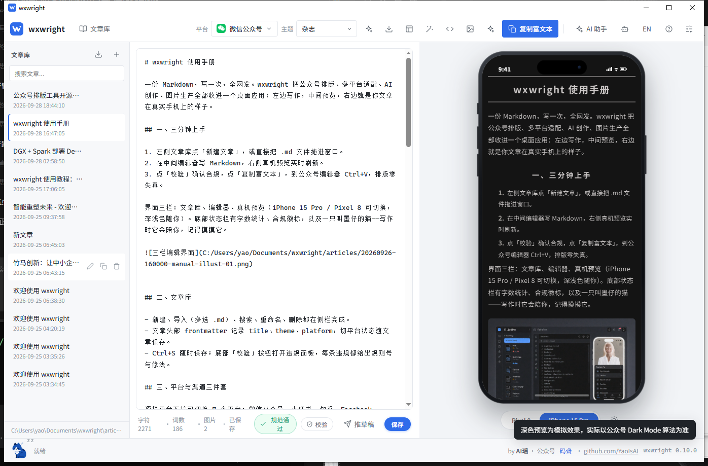

*样机下方一键切换深浅色，公众号 Dark Mode 效果提前看*

## 推草稿：最后一步也是一键

> [!NOTE]
> 绑定公众号 API 后（设置 → 公众号 API），状态栏「推草稿」按钮直接把排版好的文章写进公众号草稿箱：本地图自动上传永久素材、阻断违规自动拦截、没有封面图会引导你选一张。

> [!WARNING]
> 公众号开放平台要求把你的出口 IP 加入白名单（设置与开发 → 基本配置 → IP 白名单）。换网络后需要重新添加——遇到 40164 错误就是它，应用会把该加的 IP 直接提示给你。

从写完到草稿箱，全程不离开这个窗口。审核排版、点群发，在公众号后台完成。

## 关于作者

wxwright 由 AI瑶 开发，完全免费、完全开源：


*公众号「码聋」：扫码关注，后台回复任何问题*

- GitHub：github.com/YaoIsAI/wxwright（点个 Star 是对开源作者最大的鼓励）
- 下载：Releases 页面提供 Windows / macOS / Linux 安装包与便携 CLI
- Agent 用户：`wxwright agent-card --md` 拿卡片即插即用

> [!TIP]
> 最后一个彩蛋：你现在看到的这篇文章——包括全部 18 张截图、每一张卡片、这张图表——就是用 wxwright 自己排版、自己推进草稿箱的。引擎没有「排版」这个概念，它只有正确。
